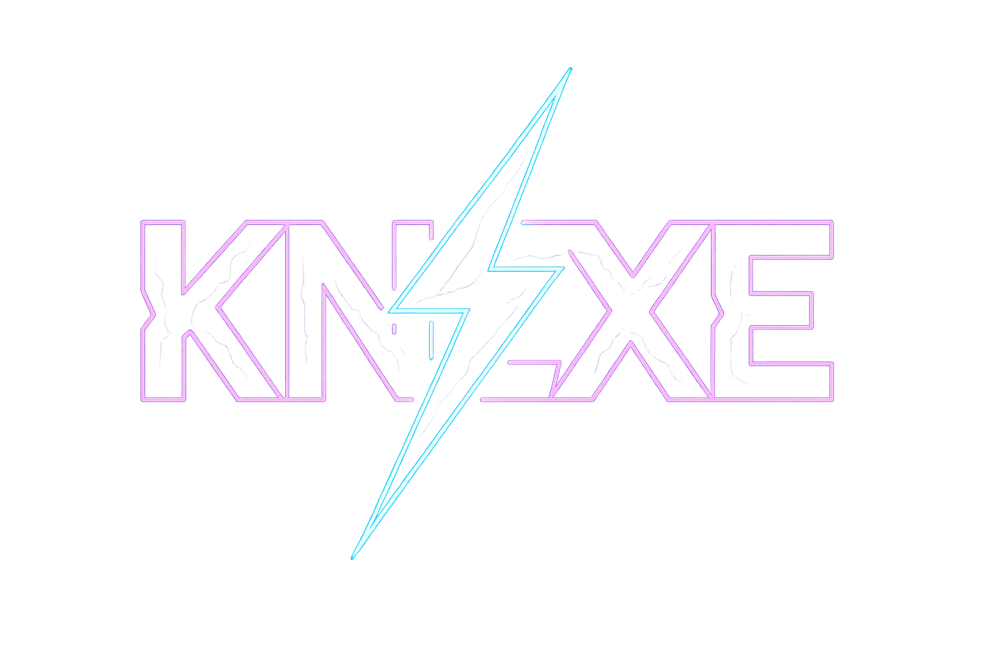

<p aling="center">
  
</p>
<p align="center"><strong>A gateway connecting systems, applications, and services, bridging technology, networks, and imagination</strong></p>

<p align="center">⚡⚡⚡</p>

<p align="center">
  
</p>

## Workspace Dependencies

### Required

- **nx**: monorepo/workspace manager.
- **commitizen**: conventional commits cli.
- **prettier**: formatter.
- **eslint**: linter.

```bash
npm install --global
nx \
  commitizen \
  prettier \
  eslint
```

## License

**KNEXE** is licensed under the _MIT License_.

<p align="center">⚡🫶⚡</p>
